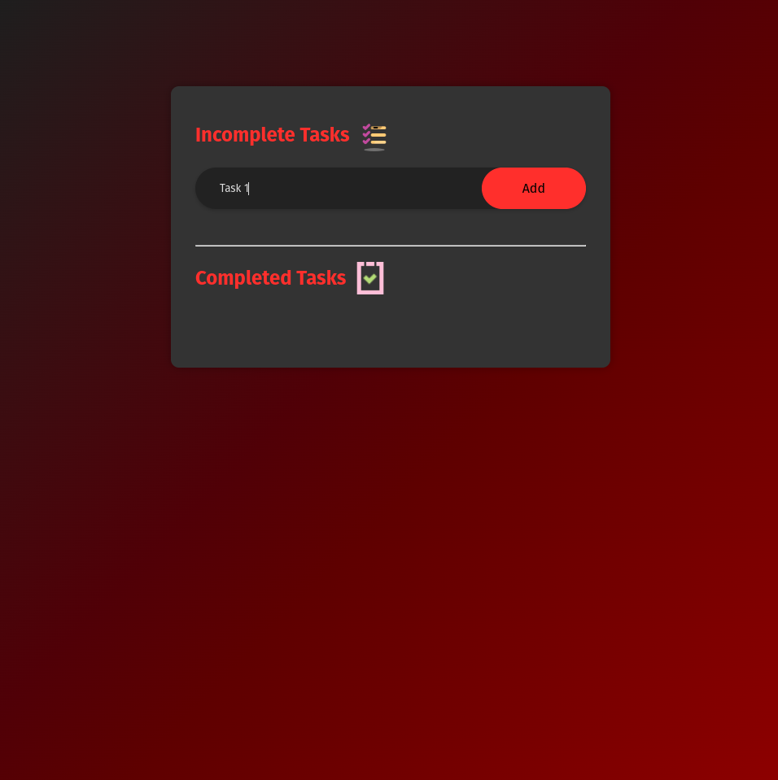
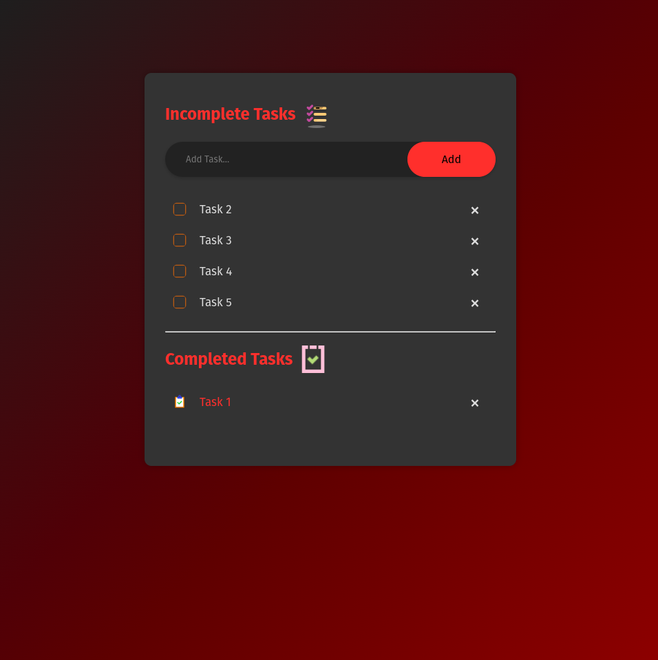
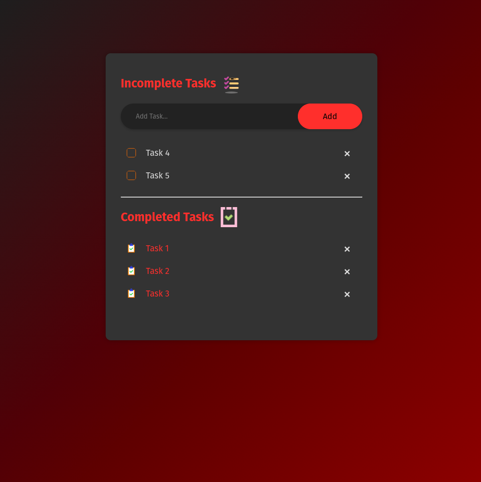
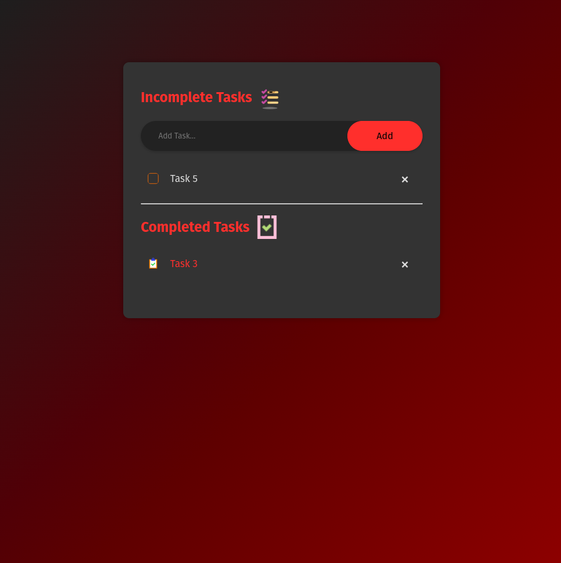

<h1>To-Do List Application</h1>

<h2>Overview</h2>

This To-Do List application enables users to efficiently manage their tasks by adding, marking as complete, and deleting items. It utilizes the browser's local storage to ensure that all tasks are preserved across sessions, providing a seamless user experience. The application is live and can be accessed at https://dark-programer.github.io/inferno-todo.

<h2>Features</h2>
<ul>
    <li>Add new tasks</li>
    <li>Mark tasks as completed</li>
    <li>Delete tasks</li>
    <li>Persist tasks using browser local storage</li>
</ul>

<h2>Technologies Used</h2>
<ul>
    <li>HTML</li>
    <li>CSS</li>
    <li>JavaScript</li>
    <li>Local Storage API</li>
</ul>

<h2>Installation</h2>
<ol>
    <li>Clone the repository:
        <pre><code>git clone https://github.com/Dark-Programer/inferno-todo.git</code></pre>
    </li>
    <li>Navigate to the project directory:
        <pre><code>cd inferno-todo</code></pre>
    </li>
    <li>Open <code>index.html</code> in your browser to see the application in action.</li>
</ol>

<h2>File Structure</h2>
<pre><code>.
├── Screenshots
│   ├── image1.png
│   ├── image2.png
│   ├── image3.png
│   └── image4.png
│   └── image5.png
│   └── image6.png
├── assets
│   ├── appIcon.png
│   ├── completedIcon.png
│   ├── checked.png
│   └── unchecked.png
├── index.html
├── README.md
├── style.css
└── script.js
</code></pre>

<h2>Usage</h2>
<ol>
    <li><strong>Add a Task:</strong>
        
Type a task into the input box and click the "Add" button. The task will appear in the "Incomplete Tasks" list.

    </li>
    <li><strong>Complete a Task:</strong>
        
Click on a task to mark it as completed. The task will move to the "Completed Tasks" list.

    </li>
    <li><strong>Delete a Task:</strong>
        
Click the "x" icon next to a task to delete it. If the task is in the "Incomplete Tasks" list and is not marked as completed, it will be removed immediately. If it is in the "Completed Tasks" list, it will be removed immediately.

    </li>
</ol>

<h2>Code Overview</h2>
<h3>HTML</h3>

The HTML file contains the structure of the application, including:

<ul>
    <li>Input box for adding new tasks</li>
    <li>Buttons to trigger actions</li>
    <li>Unordered lists for displaying tasks</li>
</ul>

<h3>CSS</h3>

The CSS file styles the application, providing:

<ul>
    <li>Layout and design for the container and elements</li>
    <li>Colors and themes for both incomplete and completed tasks</li>
    <li>Hover effects and responsive design elements</li>
</ul>

<h3>JavaScript</h3>

The JavaScript file contains the logic for the application, including:

<ul>
    <li>Function to add new tasks</li>
    <li>Event listeners for marking tasks as completed or deleting them</li>
    <li>Functions for storing and retrieving tasks from local storage</li>
</ul>

<h4>Key Functions</h4>
<ul>
    <li><code>addTask()</code>: Adds a new task to the list.</li>
    <li><code>useBrowserLocalStorage()</code>: Saves the current state of tasks to local storage.</li>
    <li><code>displayTask()</code>: Loads tasks from local storage when the page is loaded.</li>
    <li>Event listeners for handling task interactions (clicking on tasks and delete icons).</li>
</ul>

<h2>Local Storage</h2>

Tasks are saved in the browser's local storage using the <code>localStorage</code> API. This ensures that tasks persist even after the page is refreshed.

<h2>Contributing</h2>
<ol>
    <li>Fork the repository</li>
    <li>Create a new branch (<code>git checkout -b feature-branch</code>)</li>
    <li>Make your changes and commit them (<code>git commit -m 'Add new feature'</code>)</li>
    <li>Push to the branch (<code>git push origin feature-branch</code>)</li>
    <li>Create a new Pull Request</li>
</ol>

<h2>Screenshot</h2>

  
  
  
  
  
  

<h2>Acknowledgments</h2>

Icons from <a href="https://icons8.com">Icons8</a>

